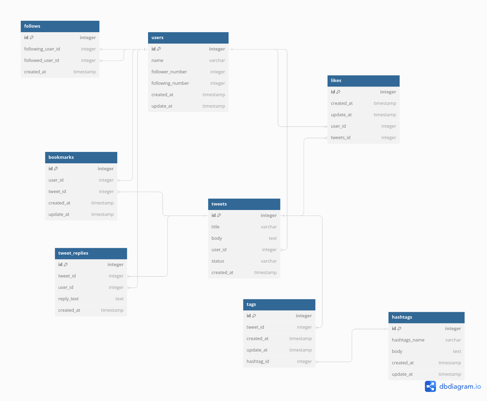

# README

This README would normally document whatever steps are necessary to get the
application up and running.

Things you may want to cover:

* Ruby version

* System dependencies

* Configuration

* Database creation

* Database initialization

* How to run the test suite

* Services (job queues, cache servers, search engines, etc.)

* Deployment instructions

* ...
  
## Tables and Explanation

### `users`

- `id` (Primary Key): The unique identifier for each user.
- `name`: The name of the user.
- `follower_number`: The number of followers the user has.
- `following_number`: The number of users the user is following.
- `created_at`: The timestamp when the user was created.
- `updated_at`: The timestamp when the user was last updated.

### `tweets`

- `id` (Primary Key): The unique identifier for each tweet.
- `title`: The title of the tweet.
- `body` (Note: Post content): The body of the tweet.
- `user_id`: The ID of the user who posted the tweet.
- `status`: The status of the tweet.
- `created_at`: The timestamp when the tweet was created.

### `follows`

- `id` (Primary Key): The unique identifier for each follow relationship.
- `following_user_id`: The ID of the user who is following.
- `followed_user_id`: The ID of the user being followed.
- `created_at`: The timestamp when the relationship was created.

   Relationships:
   - `following_user_id` belongs to `users.id` (many-to-one relationship).
   - `followed_user_id` belongs to `users.id` (many-to-one relationship).

### `bookmarks`

- `id` (Primary Key): The unique identifier for each bookmark.
- `user_id`: The ID of the user who created the bookmark.
- `tweet_id`: The ID of the tweet that has been bookmarked.
- `created_at`: The timestamp when the bookmark was created.
- `updated_at`: The timestamp when the bookmark was last updated.

   Relationships:
   - `user_id` belongs to `users.id` (many-to-one relationship).
   - `tweet_id` belongs to `tweets.id` (many-to-one relationship).

### `likes`

- `id` (Primary Key): The unique identifier for each "like".
- `created_at`: The timestamp when the "like" was given.
- `updated_at`: The timestamp when the "like" was last updated.
- `user_id`: The ID of the user who gave the "like".
- `tweets_id`: The ID of the tweet that received the "like".

   Relationships:
   - `user_id` belongs to `users.id` (many-to-one relationship).
   - `tweets_id` belongs to `tweets.id` (many-to-one relationship).

### `tags`

- `id` (Primary Key): The unique identifier for each tag.
- `tweet_id`: The ID of the tweet associated with the tag.
- `created_at`: The timestamp when the tag was created.
- `updated_at`: The timestamp when the tag was last updated.
- `hashtag_id`: The ID of the hashtag associated with the tag.

   Relationships:
   - `tweet_id` belongs to `tweets.id` (many-to-one relationship).
   - `hashtag_id` belongs to `hashtags.id` (many-to-one relationship).

### `hashtags`

- `id` (Primary Key): The unique identifier for each hashtag.
- `hashtags_name`: The name of the hashtag.
- `body`: Text related to the hashtag.
- `created_at`: The timestamp when the hashtag was created.
- `updated_at`: The timestamp when the hashtag was last updated.

### `tweet_replies`

- `id` (Primary Key): The unique identifier for each tweet reply.
- `tweet_id` (Note: Parent tweet ID): The ID of the tweet being replied to.
- `user_id`: The ID of the user who made the reply.
- `reply_text` (Note: Reply content): The content of the tweet reply.
- `created_at`: The timestamp when the reply was created.

### Relationships

- `tweets.user_id` belongs to `users.id` (many-to-one relationship).
- `follows.following_user_id` belongs to `users.id` (many-to-one relationship).
- `follows.followed_user_id` belongs to `users.id` (many-to-one relationship).
- `likes.user_id` belongs to `users.id` (many-to-one relationship).
- `likes.tweets_id` belongs to `tweets.id` (many-to-one relationship).
- `bookmarks.tweet_id` belongs to `tweets.id` (many-to-one relationship).
- `bookmarks.user_id` belongs to `users.id` (many-to-one relationship).
- `tags.hashtag_id` belongs to `hashtags.id` (many-to-one relationship).
- `tags.tweet_id` belongs to `tweets.id` (many-to-one relationship).
- `tweet_replies.tweet_id` belongs to `tweets.id` (many-to-one relationship).
- `tweet_replies.user_id` belongs to `users.id` (many-to-one relationship).

   
